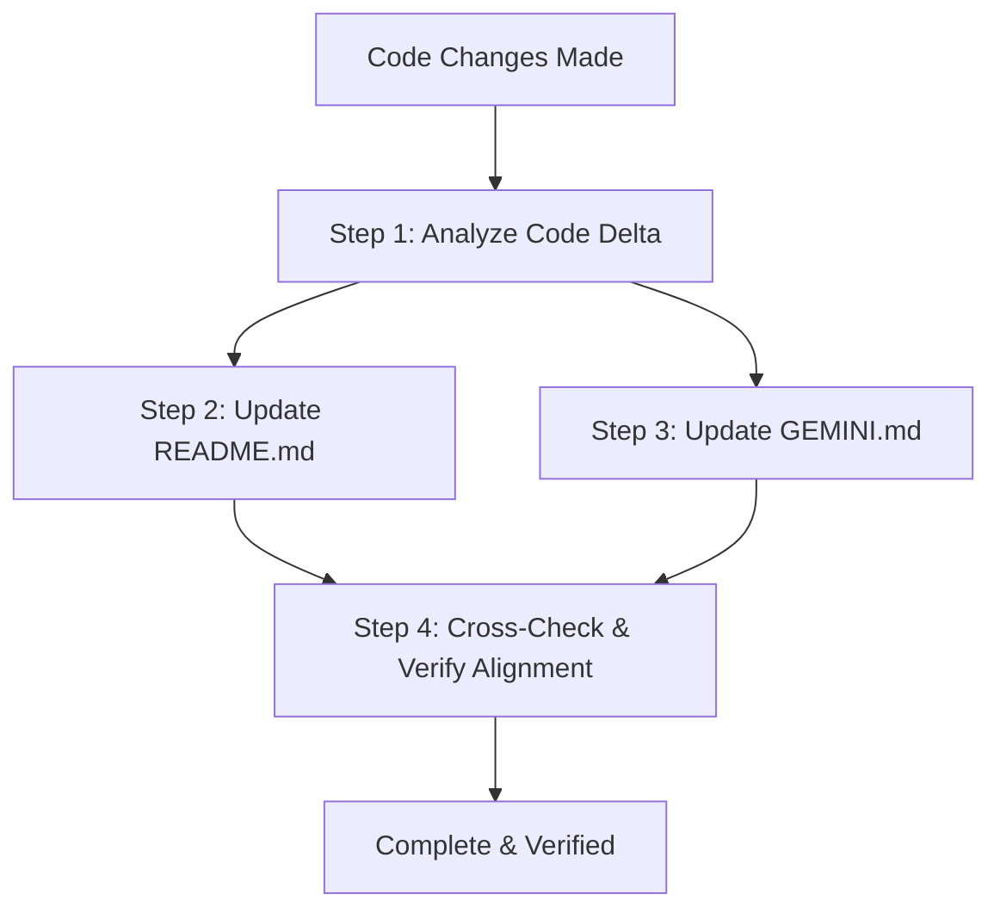

# Sync Docs on Code Change Skill

This skill guarantees that **[`README.md`](../../README.md)** and **[`GEMINI.md`](../../GEMINI.md)** remain strictly up-to-date, accurate, and aligned with every modification to the codebase (`index.html`, `style.css`, `app.js`, CI/CD workflows, configuration files, etc.).

---

## 1. When to Trigger This Skill

Execute this workflow **immediately after modifying code files** whenever any of the following occur:
1. **UI / Feature Additions or Modifications**: New components, interactive widgets, forms, carousels, or visual art are added or altered in `index.html` or `app.js`.
2. **CSS Token & Style Updates**: Changes to `:root` design tokens, color palettes, animations (`@keyframes`), typography, or responsive layouts in `style.css`.
3. **Physics & Mathematics Revisions**: Adjustments to anti-gravity drift kinetics, mouse parallax dampening, canvas drawing math, or confetti ballistics.
4. **DSP & Web Audio Synthesizer Changes**: Tweaks to oscillator waveforms, harmonic partials, audio scales, chord frequencies, gain ADSR envelopes, or sound triggers.
5. **State & LocalStorage Schema Changes**: Modifications to data structures, storage keys, filters, sanitization routines, or event handlers.
6. **Infrastructure & CI/CD Changes**: Updates to GitHub Actions workflows (`.github/workflows/`), deployment configs, or script helpers.

---

## 2. Step-by-Step Execution Runbook

### Step 1: Analyze Code Delta & Extract Technical Details
Review the exact changes made across all modified files. Note down:
- **Files Modified / Added / Removed**: E.g., `index.html`, `style.css`, `app.js`, `.github/workflows/static.yml`.
- **CSS Variables & Tokens**: Any additions, renamings, or value shifts in `:root`.
- **Mathematical Formulas**: Any changes to motion kinematics, oscillation amplitudes, or easing coefficients.
- **Audio DSP Synthesizers**: Oscillator types, frequency tables, harmonic modes, or attack/decay envelopes.
- **Data Schemas & Storage**: Changes to LocalStorage keys or tribute object properties.
- **DOM & UX Controls**: New buttons, modals, input elements, or interactive triggers.

---

### Step 2: Synchronize `README.md` (User & Developer Facing)
Update [`README.md`](../../README.md) to ensure high-level clarity and developer onboarding accuracy:

1. **Badges & Overview**:
   - Verify badge metrics, feature counts, and framework/dependency status (Zero Dependencies).
2. **Feature Highlights**:
   - Update descriptions for modified or new components (e.g., Hero Showcase, Anti-Gravity engine, Quote Carousel, Gratitude Wall, Dedication Studio Canvas, Web Audio Synthesizer).
   - Ensure interaction instructions (e.g., keyboard shortcuts, button triggers, canvas download formats) reflect actual UI behavior.
3. **Getting Started & Usage**:
   - Ensure local run instructions (`start index.html`, `python -m http.server`) match current requirements.
4. **Project Structure**:
   - Update directory tree and file size/purpose annotations if files are added or restructured.

---

### Step 3: Synchronize `GEMINI.md` (Engineering & Architectural Specification)
Update [`GEMINI.md`](../../GEMINI.md) to maintain comprehensive technical, mathematical, and architectural depth:

1. **System Architecture & Mermaid Diagrams**:
   - Update ASCII architecture boxes and Mermaid block/flow diagrams to reflect component relationships and data flow.
2. **Design Token System & CSS Variable Architecture**:
   - Update the `:root` code block to match all active tokens in `style.css`.
   - Maintain token categorization (Cosmic Bases, Gold Illumination, Academic Jewel Accents, Sticky Note Themes, Typography).
3. **Mathematical & Physics Modeling**:
   - Update LaTeX equations ($\LaTeX$) for kinetic motion, angular oscillation, exponential moving average mouse smoothing, and confetti drag/gravity dynamics.
   - Update parameter tables (sway periods, amplitudes, spawn counts, drag coefficients).
4. **Digital Signal Processing (DSP) & Web Audio Engine**:
   - Update the harmonic partials table (frequency multipliers $f_n$, relative gain $G_n$, oscillator waveforms, decay times).
   - Update musical scale sets (e.g., Pentatonic scale frequencies $\mathcal{S}$) and celebration arpeggios.
5. **Core Subsystems & Data Specifications**:
   - Synchronize TypeScript/JSON interface definitions for storage entities (e.g., `Tribute` object model, localStorage keys).
   - Document security/sanitization safeguards (e.g., `escapeHTML`).
   - Document Canvas rendering dimensions, word-wrapping algorithms, and export targets (PNG, WhatsApp).
6. **Performance & Asset Metrics**:
   - Update First Contentful Paint (FCP), frame rates (60–120 FPS), payload sizes, and JS runtime overhead.
7. **Git Commit History & Architecture Log**:
   - Append or update the commit timeline / mermaid gitGraph with the latest changes and architectural version notes.

---

### Step 4: Verification & Consistency Checklist

Before concluding the task, perform the following quality checks:

- [ ] **No Dead Links**: Every markdown link between `README.md`, `GEMINI.md`, and source files is valid.
- [ ] **Accurate File References**: All function, variable, and class references match actual code symbols.
- [ ] **Mermaid & LaTeX Validity**: Verify Mermaid diagrams and math formatting render cleanly without syntax errors.
- [ ] **Zero Stale Information**: Ensure deprecated features, old token names, or removed DOM IDs are purged from both documents.
- [ ] **Formatting Consistency**: Maintain GitHub-flavored markdown standards, clean table alignments, and callout alerts where appropriate.
