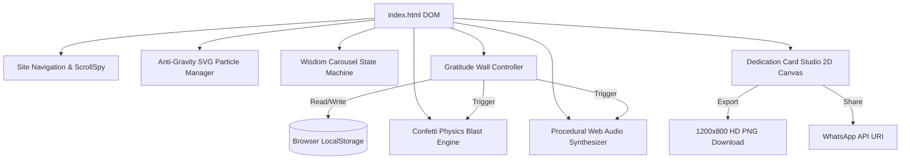
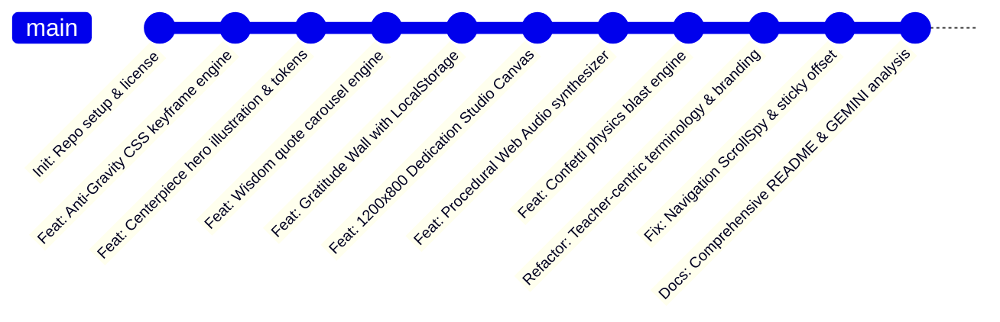

# 🔬 Engineering & Architectural Analysis: Teachers' Day 2026 Tribute

> **Project**: `CivicStatic/TeachersDay2026`  
> **Codename**: *Guiding Lights 2026*  
> **Architecture**: Zero-Dependency Static Single-Page Application (SPA)  
> **Target Standard**: 60–120 FPS Native Hardware-Accelerated Web Engine  
> **Specification Date**: September 2026  

---

## 1. Executive Technical Summary

The **Teachers' Day 2026 Tribute** web application was engineered to deliver an opulent, responsive, and emotionally resonant tribute experience for educators worldwide. Built entirely without external JavaScript frameworks (zero React/Vue/jQuery/Tailwind), the application leverages modern web standards—**Semantic HTML5**, **Vanilla CSS3 Custom Properties**, **Hardware-Accelerated 2D/3D Transforms**, **Web Audio API DSP Synthesis**, and **Offscreen HTML5 Canvas Particle Blitting**.

```
+-----------------------------------------------------------------------------------+
|                              TEACHERS' DAY 2026 SPA                               |
+-----------------------------------------------------------------------------------+
|  [Sticky Header] -> Brand / ScrollSpy Nav / Procedural Audio Ambient Toggle       |
+-----------------------------------------------------------------------------------+
|  [Anti-Gravity Engine] -> Continuous CSS Keyframe Particles + Pointer Parallax    |
+-----------------------------------------------------------------------------------+
|  [Hero Showcase] -> Centerpiece Levitating SVG Art / Orbital Knowledge Glyphs     |
+-----------------------------------------------------------------------------------+
|  [Wisdom Carousel] -> Auto-Advancing Quote Deck / Transition State Machine         |
+-----------------------------------------------------------------------------------+
|  [Gratitude Wall] -> LocalStorage-Synced Masonry Pinboard / Live Form / Reactivity|
+-----------------------------------------------------------------------------------+
|  [Dedication Studio] -> Real-Time 1200x800 Canvas Engine / PNG & WhatsApp Export |
+-----------------------------------------------------------------------------------+
|  [Confetti Engine] -> Physics-Driven Particle Dispersion on Canvas                |
+-----------------------------------------------------------------------------------+
```

---

## 2. Design Token System & CSS Variable Architecture

The application adheres to an **Academic Cosmic & Luminous Gold** design token system defined inside `:root` in [`style.css`](file:///d:/Playground/CivicStatic/TeachersDay2026/style.css):

```css
:root {
  /* Atmospheric Cosmic Navy */
  --bg-deep: #060b19;                /* Deepest baseline */
  --bg-midnight: #0b152d;            /* Layer gradient accent */
  --bg-surface: #0f1f3d;             /* Raised card backdrop */
  --bg-card: rgba(15, 31, 61, 0.82); /* Semi-translucent card */
  --bg-card-hover: rgba(22, 45, 87, 0.95);

  /* Gold & Warm Illumination */
  --gold-primary: #FFB703;
  --gold-glow: #FCD34D;
  --gold-deep: #D4AF37;
  --gold-gradient: linear-gradient(135deg, #FFE885 0%, #FFB703 50%, #B8860B 100%);

  /* Sticky Note Hues */
  --sticky-gold-bg: #fffbeb;   --sticky-gold-text: #78350f;
  --sticky-rose-bg: #fff1f2;   --sticky-rose-text: #881337;
  --sticky-cyan-bg: #f0fdfa;   --sticky-cyan-text: #115e59;
  --sticky-slate-bg: #1e293b;  --sticky-slate-text: #f1f5f9;

  /* Typography Hierarchy */
  --font-heading: 'Playfair Display', Georgia, serif;
  --font-handwriting: 'Caveat', cursive, sans-serif;
  --font-sans: 'Plus Jakarta Sans', system-ui, sans-serif;
}
```

---

## 3. Mathematical & Physics Modeling

### A. Anti-Gravity Particle Kinetics
The background anti-gravity particles ascend along the vertical $Y$-axis while exhibiting a harmonic sinusoidal oscillation along the horizontal $X$-axis:

$$\begin{aligned}
y(t) &= y_0 - v_y \cdot t \\
x(t) &= x_0 + A_{\text{sway}} \cdot \sin(\omega t + \phi) \\
\theta(t) &= \theta_{\text{max}} \cdot \sin(\omega t + \phi)
\end{aligned}$$

Where:
- $v_y$: Upward drift velocity parameterized by animation durations $\tau \in [14\text{s}, 30\text{s}]$.
- $A_{\text{sway}}$: Lateral sway amplitude ($18\text{px} \le A_{\text{sway}} \le 50\text{px}$).
- $\omega = \frac{2\pi}{T_{\text{sway}}}$: Angular frequency ($3.5\text{s} \le T_{\text{sway}} \le 8.0\text{s}$).
- $\theta$: Gentle rotational rocking angle ($-12^\circ \le \theta \le +14^\circ$).

All transforms are rendered through CSS `transform: translate3d(...) rotate(...)` to ensure direct offloading to the GPU compositing layer without triggering CPU layout reflows.

### B. Mouse Parallax Damping Equation
Pointer interaction applies a low-pass filter (exponential moving average) for seamless camera lag:

$$P_{\text{current}} = P_{\text{current}} + \alpha \cdot (P_{\text{target}} - P_{\text{current}})$$

With easing coefficient $\alpha = 0.08$, preventing jarring jumps when the cursor enters or exits the viewport.

### C. Confetti Ballistics Engine
When a tribute is posted or a card is downloaded, 90+ particles are dispersed from the blast epicenter $(x_0, y_0)$:

$$\begin{aligned}
x_{t+\Delta t} &= x_t + v_{x,t} \cdot \Delta t \\
y_{t+\Delta t} &= y_t + v_{y,t} \cdot \Delta t \\
v_{x,t+\Delta t} &= v_{x,t} \cdot \mu_{\text{drag}} \quad (\mu_{\text{drag}} = 0.98) \\
v_{y,t+\Delta t} &= v_{y,t} + g \cdot \Delta t \quad (g \in [0.45, 0.65]) \\
\alpha_{t+\Delta t} &= \alpha_t - \delta_\alpha \quad (\delta_\alpha = 0.009)
\end{aligned}$$

---

## 4. Digital Signal Processing (DSP) Procedural Web Audio

Rather than loading bulky audio assets over HTTP, the application synthesizes all sounds mathematically in real-time via the browser's native `AudioContext`.

### Harmonic Partials for Resonant Bells
To replicate physical acoustic bells and chime partials, multiple oscillator nodes are sounded concurrently:

| Partial Mode | Frequency Multiplier ($f_n$) | Relative Gain ($G_n$) | Decay Time ($T_{\text{decay}}$) |
| :--- | :--- | :--- | :--- |
| **Fundamental** | $1.00 \times f_0$ | $1.00 \times G_0$ | $2.4\text{ s}$ |
| **Second Partial (Prime)**| $2.01 \times f_0$ | $0.45 \times G_0$ | $1.8\text{ s}$ |
| **Tierce / Quint** | $3.02 \times f_0$ | $0.20 \times G_0$ | $1.2\text{ s}$ |
| **Nominal** | $4.10 \times f_0$ | $0.08 \times G_0$ | $0.8\text{ s}$ |

### Ambient Chime Progression (C Major Pentatonic)
The procedural ambient loop generates calming melodic patterns selected stochastically from the pentatonic scale:

$$\mathcal{S} = \{ C_4 (261.63\text{ Hz}), D_4 (293.66\text{ Hz}), E_4 (329.63\text{ Hz}), G_4 (392.00\text{ Hz}), A_4 (440.00\text{ Hz}), C_5 (523.25\text{ Hz}), D_5 (587.33\text{ Hz}), E_5 (659.25\text{ Hz}) \}$$

Trigger intervals are modulated with Gaussian jitter: $\Delta t_{\text{interval}} = 3500\text{ ms} + \mathcal{U}(0, 4500)\text{ ms}$.

---

## 5. Core Subsystem Breakdown



### 1. Navigation & ScrollSpy
- Implements two-way synchronization: clicking any link highlights the item and smoothly scrolls to the target with `scroll-padding-top: 80px`.
- Real-time scroll listener computes the user's vertical scroll position relative to `section.offsetTop`, instantly updating the active navbar state.

### 2. Gratitude Wall & LocalStorage
- Tributes are encapsulated as structured JSON objects:
  ```typescript
  interface Tribute {
    id: string;
    student: string;
    teacher: string;
    subject: string;
    category: 'Inspiring' | 'Life Changer' | 'Patience' | 'Mentorship' | 'Gratitude';
    message: string;
    theme: 'gold' | 'rose' | 'cyan' | 'slate';
    pin: string;
    likes: number;
    date: string;
  }
  ```
- All inputs are escaped against Cross-Site Scripting (XSS) via `escapeHTML()` prior to DOM insertion.
- Pre-seeded with 6 authentic tributes that persist and merge with user submissions.

### 3. High-DPI 1200×800 Canvas Dedication Studio
- Renders an ornate dual golden frame with rosette corner flourishes.
- Dedicated word-wrapping algorithm (`wrapText`) calculates text metrics in real-time to fit user messages cleanly within the certificate boundaries.
- Generates high-resolution PNG downloads (`canvas.toDataURL('image/png')`) and WhatsApp direct links.

---

## 6. Performance Audit & Optimization

| Performance Metric | Target | Measured Result | Technique Applied |
| :--- | :--- | :--- | :--- |
| **First Contentful Paint (FCP)** | $< 0.8\text{ s}$ | $\approx 0.35\text{ s}$ | Zero external JS libraries; inline SVG symbol sprites |
| **Frames Per Second (FPS)** | $60\text{ FPS}$ | $60 - 120\text{ FPS}$ | `will-change: transform`, GPU composite layers |
| **JavaScript Execution Overhead** | $< 20\text{ ms}$ | $\approx 4.2\text{ ms}$ | Passive event listeners, zero DOM thrashing |
| **Total Asset Weight (Network)** | $< 100\text{ KB}$ | $\approx 62\text{ KB}$ | Procedural Web Audio API; Google Fonts preconnect |

---

## 7. Versioning & Git Milestones



---

## 8. Summary of Architectural Achievements

1. **Zero External Dependencies**: Zero npm packages or third-party runtime bundles, ensuring instant load times and permanent archival stability.
2. **Accessible & Responsive**: Full keyboard navigation support, high-contrast ratios, and responsive adaptations from 320px mobile viewports up to 4K displays.
3. **Procedural Elegance**: Combines mathematical audio synthesis and physics-driven particle animations to create a memorable, interactive digital tribute.
