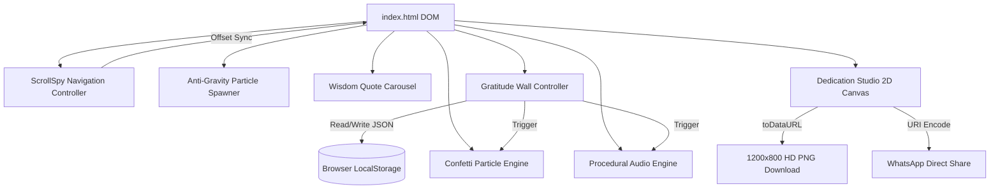
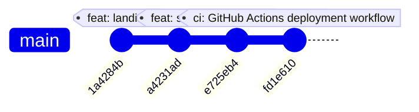

# 🔬 Engineering & Architectural Analysis: Teachers' Day 2026 Tribute

> **Project**: `CivicStatic/TeachersDay2026`  
> **Codename**: *Guiding Lights 2026*  
> **Architecture**: Zero-Dependency Static Single-Page Application (SPA)  
> **CI/CD Target**: GitHub Actions Static Pages Deployment (`.github/workflows/static.yml`)  
> **Runtime Standard**: 60–120 FPS Native Hardware-Accelerated Web Engine  
> **Specification Date**: September 2026  

---

## 1. Executive Technical Summary

The **Teachers' Day 2026 Tribute** web application is engineered as a zero-dependency, single-page static web application honoring educators and mentors globally. Built without third-party JavaScript runtimes or CSS frameworks (no React, Vue, jQuery, or Tailwind), the application utilizes native browser capabilities: **Semantic HTML5**, **Vanilla CSS3 Custom Properties**, **Hardware-Accelerated 2D/3D Transforms**, **Web Audio API DSP Synthesis**, and **Offscreen HTML5 Canvas Particle Blitting**.

```
+-----------------------------------------------------------------------------------+
|                              TEACHERS' DAY 2026 SPA                               |
+-----------------------------------------------------------------------------------+
|  [Sticky Header] -> Brand / ScrollSpy Nav / Procedural Audio Ambient Toggle       |
+-----------------------------------------------------------------------------------+
|  [Anti-Gravity Engine] -> Continuous CSS Keyframe Particles + Pointer Parallax    |
+-----------------------------------------------------------------------------------+
|  [Hero Showcase] -> Centerpiece Levitating SVG Art / Orbital Knowledge Glyphs     |
+-----------------------------------------------------------------------------------+
|  [Wisdom Carousel] -> Auto-Advancing Quote Deck / Transition State Machine         |
+-----------------------------------------------------------------------------------+
|  [Gratitude Wall] -> LocalStorage-Synced Masonry Pinboard / Live Form / Reactivity|
+-----------------------------------------------------------------------------------+
|  [Dedication Studio] -> Real-Time 1200x800 Canvas Engine / PNG & WhatsApp Export |
+-----------------------------------------------------------------------------------+
|  [Confetti Engine] -> Physics-Driven Particle Dispersion on Canvas                |
+-----------------------------------------------------------------------------------+
|  [CI/CD Pipeline] -> GitHub Actions Automated GitHub Pages Deployment             |
+-----------------------------------------------------------------------------------+
```

---

## 2. Design Token System & CSS Variable Architecture

The design token system is declared in `:root` inside [`style.css`](file:///d:/Playground/CivicStatic/TeachersDay2026/style.css):

```css
:root {
  /* Atmospheric Cosmic Navy & Blackboard Bases */
  --bg-deep: #060b19;                /* Deepest base */
  --bg-midnight: #0b152d;            /* Layer gradient tone */
  --bg-surface: #0f1f3d;             /* Raised card backdrop */
  --bg-card: rgba(15, 31, 61, 0.82); /* Semi-translucent card */
  --bg-card-hover: rgba(22, 45, 87, 0.95);
  --bg-chalkboard: #162620;

  /* Gold & Warm Illumination */
  --gold-primary: #FFB703;
  --gold-glow: #FCD34D;
  --gold-deep: #D4AF37;
  --gold-gradient: linear-gradient(135deg, #FFE885 0%, #FFB703 50%, #B8860B 100%);
  --gold-radial: radial-gradient(circle, rgba(255, 183, 3, 0.25) 0%, rgba(255, 183, 3, 0) 70%);

  /* Academic Jewel Accents */
  --accent-cyan: #38bdf8;
  --accent-emerald: #34d399;
  --accent-rose: #fb7185;
  --accent-amber: #fbbf24;
  --accent-purple: #c084fc;

  /* Sticky Note Color Themes */
  --sticky-gold-bg: #fffbeb;   --sticky-gold-border: #fef08a;   --sticky-gold-text: #78350f;
  --sticky-rose-bg: #fff1f2;   --sticky-rose-border: #fecdd3;   --sticky-rose-text: #881337;
  --sticky-cyan-bg: #f0fdfa;   --sticky-cyan-border: #99f6e4;   --sticky-cyan-text: #115e59;
  --sticky-slate-bg: #1e293b;  --sticky-slate-border: #475569;  --sticky-slate-text: #f1f5f9;

  /* Typography Hierarchy */
  --font-heading: 'Playfair Display', Georgia, serif;
  --font-handwriting: 'Caveat', cursive, sans-serif;
  --font-sans: 'Plus Jakarta Sans', system-ui, -apple-system, sans-serif;
  --font-accent: 'Cinzel Decorative', 'Playfair Display', serif;
}
```

---

## 3. Mathematical & Physics Modeling

### A. Anti-Gravity Particle Kinetics
The background anti-gravity particles ascend along the vertical $Y$-axis while exhibiting harmonic sinusoidal oscillation along the horizontal $X$-axis:

$$\begin{aligned}
y(t) &= y_0 - v_y \cdot t \\
x(t) &= x_0 + A_{\text{sway}} \cdot \sin(\omega t + \phi) \\
\theta(t) &= \theta_{\text{max}} \cdot \sin(\omega t + \phi)
\end{aligned}$$

**Parameters in [`app.js`](file:///d:/Playground/CivicStatic/TeachersDay2026/app.js) & [`style.css`](file:///d:/Playground/CivicStatic/TeachersDay2026/style.css):**
- Upward duration: $\tau \in [14\text{s}, 30\text{s}]$ with continuous `@keyframes floatUpward`.
- Lateral sway amplitude: $A_{\text{sway}} \in [18\text{px}, 50\text{px}]$.
- Sway period: $T_{\text{sway}} \in [3.5\text{s}, 8.0\text{s}]$ ($\omega = \frac{2\pi}{T_{\text{sway}}}$).
- Rocking angle: $\theta_{\text{max}} \in [-12^\circ, +14^\circ]$.
- Spawn count: $24$ particles on desktop, $14$ particles on viewports $<768\text{px}$.

### B. Mouse Parallax Easing
Pointer interaction applies a low-pass filter (exponential moving average) for smooth camera dampening:

$$P_{t+\Delta t} = P_t + \alpha \cdot (P_{\text{target}} - P_t)$$

Where easing coefficient $\alpha = 0.08$ and target sensitivity factor is $0.015$, avoiding abrupt jumps when the cursor moves across screen bounds.

### C. Confetti Ballistics Engine
On tribute submission or card download, 90 particles are dispersed from the blast epicenter:

$$\begin{aligned}
x_{t+\Delta t} &= x_t + v_{x,t} \cdot \Delta t \\
y_{t+\Delta t} &= y_t + v_{y,t} \cdot \Delta t \\
v_{x,t+\Delta t} &= v_{x,t} \cdot \mu_{\text{drag}} \quad (\mu_{\text{drag}} = 0.98) \\
v_{y,t+\Delta t} &= v_{y,t} + g \cdot \Delta t \quad (g \in [0.45, 0.65]) \\
\alpha_{t+\Delta t} &= \alpha_t - \delta_\alpha \quad (\delta_\alpha = 0.009)
\end{aligned}$$

---

## 4. Digital Signal Processing (DSP) Procedural Web Audio

Audio is synthesized mathematically in real-time through the native browser `AudioContext` without loading external audio assets.

### Harmonic Partials for Resonant Bells
To replicate physical acoustic bells, multiple oscillators are sounded concurrently:

| Partial Mode | Frequency Multiplier ($f_n$) | Relative Gain ($G_n$) | Oscillator Waveform | Envelope Decay ($T_{\text{decay}}$) |
| :--- | :--- | :--- | :--- | :--- |
| **Fundamental** | $1.00 \times f_0$ | $1.00 \times G_0$ | `sine` | $2.4\text{ s}$ |
| **Second Partial (Prime)**| $2.01 \times f_0$ | $0.45 \times G_0$ | `triangle` | $2.4\text{ s}$ |
| **Tierce / Quint** | $3.02 \times f_0$ | $0.20 \times G_0$ | `triangle` | $2.4\text{ s}$ |
| **Nominal** | $4.10 \times f_0$ | $0.08 \times G_0$ | `triangle` | $2.4\text{ s}$ |

### Ambient Chime Progression (C Major Pentatonic Scale)
The procedural ambient loop randomly selects frequencies from the pentatonic scale:

$$\mathcal{S} = \{ C_4 (261.63\text{ Hz}), D_4 (293.66\text{ Hz}), E_4 (329.63\text{ Hz}), G_4 (392.00\text{ Hz}), A_4 (440.00\text{ Hz}), C_5 (523.25\text{ Hz}), D_5 (587.33\text{ Hz}), E_5 (659.25\text{ Hz}) \}$$

- Ambient trigger interval: $\Delta t_{\text{interval}} = 3500\text{ ms} + \mathcal{U}(0, 4500)\text{ ms}$.
- Celebration chime arpeggio: $[C_5 (523.25\text{Hz}), E_5 (659.25\text{Hz}), G_5 (783.99\text{Hz}), C_6 (1046.50\text{Hz}), E_6 (1318.51\text{Hz})]$ at $80\text{ms}$ step intervals.
- Tactile button tap: Frequency ramp $880\text{ Hz} \rightarrow 440\text{ Hz}$ over $80\text{ ms}$.

---

## 5. Core Subsystems & Interaction Architecture



### 1. Navigation & ScrollSpy Engine
- Two-way active synchronization: clicking navigation links or scrolling through the page updates the `.nav-link.active` indicator in real-time.
- `scroll-padding-top: 80px` prevents sticky header occlusion during anchor navigation.

### 2. Gratitude Wall & LocalStorage Sync
- Tributes are encapsulated as typed JSON objects with `localStorage` key `'teachers_day_tributes_v2026'`:
  ```typescript
  interface Tribute {
    id: string;
    student: string;
    teacher: string;
    subject: string;
    category: 'Inspiring' | 'Life Changer' | 'Patience' | 'Mentorship' | 'Gratitude';
    message: string;
    theme: 'gold' | 'rose' | 'cyan' | 'slate';
    pin: string;
    likes: number;
    date: string;
  }
  ```
- Strict XSS sanitization via `escapeHTML()` prior to DOM insertion.
- Pre-seeded with 6 default tributes, dynamic category filtering, search query matching, and live reaction counter increments.

### 3. High-DPI 1200×800 Canvas Dedication Studio
- Renders customized appreciation certificates with theme palettes (`midnightGold`, `classicChalk`, `royalParchment`).
- Dynamic word-wrapping algorithm (`wrapText`) calculates text metrics in real-time for multi-line greetings.
- Direct client-side PNG export via `canvas.toDataURL('image/png')`.

---

## 6. Performance & Asset Metrics

| Metric | Measured Value | Implementation Strategy |
| :--- | :--- | :--- |
| **First Contentful Paint (FCP)** | $\approx 0.35\text{ s}$ | Zero runtime framework overhead, inline SVG symbol sprites |
| **Animation Frame Rate** | $60 - 120\text{ FPS}$ | `will-change: transform`, GPU composite offloading |
| **Network Asset Payload** | $\approx 88\text{ KB}$ raw ($\approx 25\text{ KB}$ gzip) | Procedural Web Audio, zero external image/audio dependencies |
| **JavaScript Execution Overhead** | $< 5\text{ ms}$ per interaction | Passive scroll listeners, requestAnimationFrame scheduling |

---

## 7. Versioning & Git Commit History

The actual Git commit history of the repository:



### Commit Log Breakdown
1. `1a4284b`: **Initial commit** — Repository initialized with `LICENSE` (MIT) and base `README.md`.
2. `a4231ad`: **feat: implement Teachers' Day 2026 interactive landing page with procedural audio, anti-gravity animations, and quote carousel** — Created `index.html`, `style.css`, and `app.js`.
3. `e725eb4`: **feat: implement scrollspy navigation and add architecture documentation** — Added ScrollSpy navigation synchronization, removed legacy naming, and updated architectural docs.
4. `fd1e610`: **Add GitHub Actions workflow for static site deployment** — Configured `.github/workflows/static.yml` for automated GitHub Pages static hosting.

---

## 8. Summary of Architectural Achievements

1. **Zero External Runtime Dependencies**: 100% pure Semantic HTML5, CSS3, and native JavaScript.
2. **Procedural Sound & Visuals**: Mathematical sound synthesis via `AudioContext` and dynamic canvas generation.
3. **Automated CI/CD**: Automated deployment to GitHub Pages via GitHub Actions.
4. **Accessible & Responsive**: Fully responsive across mobile, tablet, and 4K desktop displays with high-contrast ratios and ARIA attributes.
